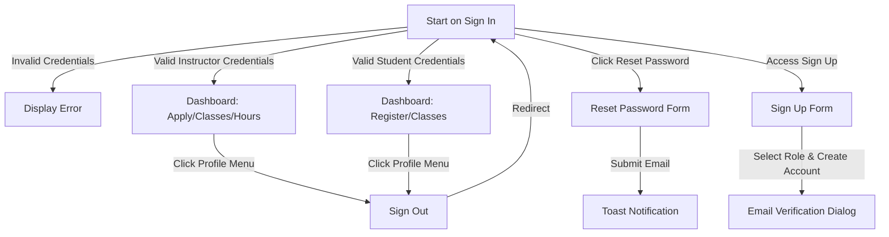

# Portal Release Test Plan

This document details the manual and automated regression test suite to verify all core features of the gbSTEM Portal website before any production release. It is structured sequentially to facilitate direct translation into Cypress E2E tests, focusing on student and instructor access.

## 1. Setup and Pre-requisites

Follow these steps to establish a clean, predictable, local testing environment.

### A. Initialize Local Configuration

1. Copy `.env.example` to `.env.local` in the `portal` directory.
2. Ensure the emulator hosts are configured (uncommented) in `.env.local`:

   ```env
   FIRESTORE_EMULATOR_HOST="127.0.0.1:8080"
   FIREBASE_AUTH_EMULATOR_HOST="127.0.0.1:9099"
   STORAGE_EMULATOR_HOST="127.0.0.1:9199"
   ```

### B. Launch Firebase Emulator Suite (If not already running)

1. Start the Firebase Emulator suite from the `admin` repository (not `portal`):

   ```bash
   npm run emulators
   ```

### C. Seed Local Emulator Database

1. Populate the emulators with mock seed data by running the `admin` repository seed script:

   ```bash
   npm run seed
   ```

### D. Run the Development Server

1. Start the SvelteKit local server for the `portal`:

   ```bash
   npm run dev
   ```

   _Verify that the portal is running at <http://localhost:5173> (or its assigned port) and you can log in._

---

## 2. Test Cases & E2E Validation Sequence

### Section A: Authentication and Navigation



#### Test Case 1: Unauthenticated Redirect to Sign In

- **Description**: Ensure unauthenticated users accessing internal routes are redirected to the sign in page.
- **Steps**:
  1. Clear any active session (e.g., by clicking "Sign Out" in the profile menu if logged in, or clearing browser cookies/localStorage).
  2. Attempt to navigate to `/dashboard`.
  3. Attempt to navigate to `/profile`.
- **Expected Results (Assertions)**:
  - Access is blocked.
  - The URL is rewritten to `/signin`.
  - The browser displays the Sign In form.

#### Test Case 2: Unsuccessful Sign In

- **Description**: Verify that sign in fails when invalid credentials are provided.
- **Steps**:
  1. Navigate to `/signin`.
  2. Type `instructor@gbstem.org` in the **Email** input.
  3. Type `wrongpassword` in the **Password** input.
  4. Click the **"Sign in"** button.
- **Expected Results (Assertions)**:
  - Sign in fails and does not redirect.
  - An alert banner displays the auth error message/styling.

#### Test Case 3a: Successful Sign In as Instructor

- **Description**: Verify that an instructor can successfully sign in and see instructor-specific links.
- **Steps**:
  1. Navigate to `/signin`.
  2. Type `instructor@gbstem.org` in the **Email** input.
  3. Type `penguin` in the **Password** input.
  4. Click the **"Sign in"** button.
- **Expected Results (Assertions)**:
  - Redirects successfully to `/dashboard`.
  - The navigation bar is visible and features links for **Dashboard**, **Apply**, and **Classes**.
  - If the instructor is accepted, the **Community Service Hours Tracker** link is also visible.
  - The **Register** link is NOT visible.

#### Test Case 3b: Successful Sign In as Student/Parent

- **Description**: Verify that a student/parent can successfully sign in and see student-specific links.
- **Steps**:
  1. Navigate to `/signin`.
  2. Type `student@gbstem.org` in the **Email** input.
  3. Type `penguin` in the **Password** input.
  4. Click the **"Sign in"** button.
- **Expected Results (Assertions)**:
  - Redirects successfully to `/dashboard`.
  - The navigation bar features links for **Dashboard**, **Register**, and **Classes**.
  - The **Apply** and **Community Service Hours Tracker** links are NOT visible.

#### Test Case 4: Password Reset Form

- **Description**: Verify the password reset flow can be triggered.
- **Steps**:
  1. Navigate to `/signin`.
  2. Click the **"Forgot password?"** link.
  3. Enter `instructor@gbstem.org` in the **Email** input.
  4. Click the **"Send email"** button.
- **Expected Results (Assertions)**:
  - A notification toast appears showing the password reset email was sent.

#### Test Case 5a: Direct Sign Up as Student/Parent

- **Description**: Verify that a new parent/student account can be created and that the navbar displays correct links after email verification.
- **Steps**:
  1. Navigate to `/signup`.
  2. Select `"Parent registering my child for classes"` in the **I am a...** dropdown.
  3. Fill out the fields:
     - **First name**: `NewStudent`
     - **Last name**: `Parent`
     - **Email**: `newstudentparent@gbstem.org`
     - **Password**: `password123`
     - **Confirm password**: `password123`
  4. Click the **"Sign up"** button.
  5. Verify redirect to `/profile` and that the email verification dialog is displayed.
  6. Verify that the navigation links (**Dashboard**, **Register**, **Classes**) are hidden.
  7. Simulate email verification (e.g. via mock auth update or refreshing the page after verifying email).
- **Expected Results (Assertions)**:
  - Account creation succeeds and redirects to `/profile`.
  - After email verification is complete and the page is refreshed:
    - The email verification banner/dialog disappears.
    - The navigation bar is now visible and features links for **Dashboard**, **Register**, and **Classes**.
    - The **Apply** and **Community Service Hours Tracker** links are NOT visible.

#### Test Case 5b: Direct Sign Up as Instructor

- **Description**: Verify that a new instructor account can be created and that the navbar displays correct links after email verification.
- **Steps**:
  1. Navigate to `/signup`.
  2. Select `"High school/college student applying to be an instructor"` in the **I am a...** dropdown.
  3. Fill out the fields:
     - **First name**: `NewInstructor`
     - **Last name**: `Teacher`
     - **Email**: `newinstructor@gbstem.org`
     - **Password**: `password123`
     - **Confirm password**: `password123`
  4. Click the **"Sign up"** button.
  5. Verify redirect to `/profile` and that the email verification dialog is displayed.
  6. Verify that the navigation links (**Dashboard**, **Apply**, **Classes**) are hidden.
  7. Simulate email verification.
- **Expected Results (Assertions)**:
  - Account creation succeeds and redirects to `/profile`.
  - After email verification is complete and the page is refreshed:
    - The email verification banner/dialog disappears.
    - The navigation bar is now visible and features links for **Dashboard**, **Apply**, and **Classes**.
    - The **Register** link is NOT visible.

---

### Section B: Student Registration & Account Management (Parent/Student Role)

#### Test Case 6: Parent Registration - Manage Multiple Children

- **Description**: Verify that a parent can add up to 5 children accounts.
- **Steps**:
  1. Log in as a student/parent user (`student@gbstem.org` / `penguin`).
  2. Navigate to `/apply` (renders as "Register").
  3. Click **"Add Child Account"** several times.
- **Expected Results (Assertions)**:
  - Each click adds a new child option (e.g., `Child 2`, `Child 3`) to the selector.
  - Adding a 6th child is blocked with an error toast: `"You can only register up to 5 children"`.

#### Test Case 7: Complete and Submit a Registration Form

- **Description**: Verify a parent can fill out and submit the registration form for a child, and the submitted data persists correctly in the database and renders in the post-submission view.
- **Steps**:
  1. Navigate to `/apply` (Register).
  2. Select `Child 1` (or whichever child is currently being registered).
  3. Fill out the **Registration Form**:
     - Student Personal Info: Name, grade, school.
     - Course Preferences: Select first and second choices for CS, Math, Science, and Engineering.
     - Agreements: Check safety agreements and age limit bypass check if appropriate.
  4. Click the **"Submit"** button.
  5. Reload the page and select the registered child (e.g. `Child 1`) from the selector.
- **Expected Results (Assertions)**:
  - A success toast is displayed.
  - Upon reloading the page and selecting the child, the form is replaced by a success card showing: `"An account has been created for [Student]!"`.

---

### Section C: Instructor Applications (Instructor Role)

#### Test Case 8: Instructor Application Submission

- Description: Verify that an instructor can fill out and submit their teaching application, and the read-only form displays the submitted values.
- Steps:
  1. Log in as an instructor.
  2. Navigate to `/apply` (renders as "Apply").
  3. Fill out the **Application Form**:
     - Contact details, school, graduation year.
     - Courses they want to teach.
     - Timeslots availability.
     - In-person / online preference.
  4. Click the **"Submit"** button.
  5. Reload the page.
- Expected Results (Assertions):
  - A success message toast is displayed.
  - Upon reloading the page, the application review page persists with the message `"Application submitted and in review!"`.
  - The form is read-only (disabled fields).
  - The disabled input fields retain the submitted values (e.g., phone number, school, availability).

#### Test Case 8b: Instructor Application Status Transition (Approved/Denied)

- Description: Verify that changing the instructor's application decision in the database updates the Dashboard and navigation links correctly.
- Steps:
  1. Complete Test Case 8 so that the instructor has a submitted application.
  2. Set the application decision to `"accepted"` in the database (`decisions{Term}/{userId}`).
  3. Navigate to `/dashboard`.
  4. Navigate to `/apply` (renders as "Apply").
  5. Set the application decision to `"rejected"` in the database.
  6. Navigate to `/dashboard`.
  7. Navigate to `/apply`.
- Expected Results (Assertions):
  - When accepted:
    - On `/dashboard`, the accepted instructor banner displays `"You have been accepted to gbSTEM as an instructor!"` and the **"Your Classes"** card is shown.
    - In the navigation bar, the **"Community Service Hours Tracker"** link is visible.
    - On `/apply`, the page still displays `"Application submitted and in review!"` with the read-only form.
  - When rejected:
    - On `/dashboard`, the rejection banner displays `"Unfortunately, instructor applications were extremely competitive, and we were not able to accept you as an instructor..."`.
    - In the navigation bar, the **"Community Service Hours Tracker"** link is NOT visible.
    - On `/apply`, the page still displays `"Application submitted and in review!"` with the read-only form.

#### Test Case 8c: Instructor Interview Slot Booking & Time Request

- Description: Verify that an instructor in the interview stage can view available slots, book a slot, or request a new slot.
- Steps:
  1. Complete Test Case 8 so that the instructor has a submitted application.
  2. Set the application decision to `"interview"` in the database (`decisions{Term}/{userId}`).
  3. Navigate to `/dashboard`.
  4. Verify that the **"Interview"** card is visible.
  5. Select an available slot from the radio list and click the **"Submit"** button.
  6. Verify that the interview status updates to show the scheduled date, interviewer name, and meeting link.
  7. (Alternative flow) If no slot works, click **"Request A Time"**, fill out a date/time, and click the **"Submit"** button.
- Expected Results (Assertions):
  - Selecting and booking a slot successfully saves the slot reservation to Firestore (updates `interviewCollection`) and displays the scheduled interview details.
  - Requesting a timeslot successfully saves a request to Firestore (creates a document under `interviewTimeRequests`) and displays a success toast.

---

### Section D: Class Roster and Details View

#### Test Case 9: Student View Enrolled Classes & Filter

- **Description**: Verify that students can view the classes they have been enrolled in, filter them by course, and toggle showing only their enrolled classes.
- **Steps**:
  1. Log in as a student who is enrolled in a class.
  2. Navigate to `/classes`.
  3. Verify that the enrolled class details are displayed.
  4. Use the course filter select dropdown to filter classes by a specific course (e.g. `"Python 1"`).
  5. Verify that only class cards matching that course are shown.
  6. Select **"all"** from the course filter select dropdown to clear.
  7. Click the **"Show all enrolled classes"** toggle button.
  8. Click the **"Show all classes"** toggle button.
- **Expected Results (Assertions)**:
  - The enrolled class details (Course, Instructor, Zoom Link, Class Time) are displayed.
  - Selecting a filter restricts the displayed class cards to the selected course.
  - Selecting "all" displays all classes again.
  - Clicking "Show all enrolled classes" hides all classes that the student's children are not enrolled in.
  - Clicking "Show all classes" displays all available classes again.

#### Test Case 10: Instructor View Taught Classes

- Description: Verify that instructors can see their roster, meeting details, and use the course filter.
- Steps:
  1. Log in as an instructor teaching a class.
  2. Navigate to `/classes`.
  3. Locate the **"Filter by course"** dropdown.
  4. Select a specific course that is taught (e.g., `"Python 1"`).
  5. Select the **"all"** option from the dropdown.
- Expected Results (Assertions):
  - The classes the instructor is teaching are displayed.
  - The roster of enrolled students is visible.
  - Meeting links and class times are rendered correctly.
  - Selecting a filter hides all classes not matching that course, showing only the filtered class.
  - Selecting "all" displays all taught classes again.

#### Test Case 10b: Instructor Submit Attendance Feedback

- Description: Verify that instructors can fill out and submit their weekly attendance and reflection feedback form for a class session.
- Steps:
  1. Log in as an instructor teaching a class.
  2. Navigate to `/classes` or `/dashboard`.
  3. Click the **"Submit Feedback"** button for a class session.
  4. In the feedback form:
     - Enter the **Date of Class**.
     - Enter the **Class Session Number**.
     - Enter reflection details in the **feedback** text field.
     - Check the attendance check box next to the names of present students.
  5. Click the **"Submit"** button.
- Expected Results (Assertions):
  - A success toast `"Class Feedback saved!"` is displayed.
  - The dialog/form closes, and the class session status updates to `"Complete"`.

---

### Section E: Community Service Tracking (Instructor Role)

#### Test Case 11: Instructor Community Service Hours

- Description: Verify accepted instructors can view their dynamically calculated community service hours and request a confirmation email.
- Steps:
  1. Log in as an accepted instructor.
  2. Navigate to `/community-service`.
  3. Verify that the total calculated hours are displayed.
  4. Click the **"Get Hours Confirmation Email"** button.
- Expected Results (Assertions):
  - The calculated hours are loaded and rendered.
  - Clicking "Get Hours Confirmation Email" displays a success toast `"Email sent successfully!"`.

---

### Section F: Profile Customization & Account Management

#### Test Case 12: Profile Modifications & Reauthentication

- **Description**: Verify name updates, email changes, password updates, and account deletion persist.
- **Steps**:
  1. Navigate to `/profile`.
  2. Update Full Name, click Save, and then reload the page to verify the name remains updated.
  3. Change Email (requires password reauthentication), reload the page, and verify the email field shows the updated email.
  4. Change Password (requires old password reauthentication).
  5. Delete Account (requires password confirmation).
- **Expected Results (Assertions)**:
  - All operations complete successfully with respective success toasts.
  - Name and email changes are confirmed to be persistent in the database and display correctly after reloading the page.
  - Deleting the account sign out the user and cleans up their auth record.

---

## Section G: Instructor Dashboard Actions (Accepted Instructor Role)

### Test Case 13: Instructor Dashboard - Manage Class Details

- Description: Verify that an accepted instructor can fill out and submit their class details, which automatically seeds their schedule and generates a meeting link.
- Steps:
  1. Log in as an accepted instructor.
  2. Navigate to `/dashboard`.
  3. Locate the **"Class Details"** form.
  4. Fill out the form fields:
     - Select a course (e.g., `"Python 1"`).
     - Enter grade recommendation (e.g., `"3-5"`).
     - Enter class capacity (e.g., `7`).
     - Select meeting day 1 and time 1.
     - Check the **"submitting"** agreement checkbox.
     - Check **"Would you like a class schedule to be automatically created for you?"**.
  5. Click the **"Submit"** button.
  6. Verify the page reloads.
  7. Locate the **"Class Details"** button on the page and click it.
  8. Click **"Edit class details"** to enable the form, edit class capacity, and submit the changes.
- Expected Results (Assertions):
  - A success toast `"Class details saved!"` is displayed.
  - The page reloads, and the **"Your Classes"** section is now populated with a list of scheduled classes.
  - A Zoom/Teams meeting link is automatically generated or shown on the class info.
  - Editing class details displays the updated values.

#### Test Case 14: Instructor Dashboard - Edit Schedule and Add Class

- Description: Verify that an instructor can modify their class dates/times and add new classes to their schedule.
- Steps:
  1. Log in as an instructor with an existing class schedule on `/dashboard`.
  2. Click the **"Edit Schedule"** button.
  3. Change the date/time of a class session or click **"Delete"** to remove a class session.
  4. Click the **"Save Changes"** button.
  5. Verify that the email notification copy modal is shown.
  6. Click the **"Add Class to Schedule"** button.
  7. Enter a date and time, and click the **"Add Class"** button.
- Expected Results (Assertions):
  - Clicking "Save Changes" prompts a modal with instructions/template to notify parents.
  - Closing the modal reloads the page with the updated schedule dates and/or deleted classes removed.
  - Adding a class successfully appends the class session to the class schedule list.

#### Test Case 15: Instructor Dashboard - Request Sub

- Description: Verify that an instructor can submit a substitute request for a scheduled class session.
- Steps:
  1. Log in as an instructor with an existing class schedule on `/dashboard`.
  2. Locate a scheduled class session in the list.
  3. Click the **"Request Sub"** button.
  4. In the dialog, verify the class number and date, enter help notes/topics.
  5. Click the **"Confirm Request"** button.
- Expected Results (Assertions):
  - A success toast `"Sub request sent!"` is displayed.
  - The page reloads, and the sub request is saved in the database under `subRequests/{classId}---{classNumber}`.

---

## Section H: Student / Parent Dashboard Actions (Student/Parent Role)

### Test Case 16: Student Dashboard Navigation - Create or View Student Account

- Description: Verify that clicking the dashboard action button redirects the parent to the student registration page.
- Steps:
  1. Log in as a student/parent.
  2. On `/dashboard`, locate the **"Your Students"** card.
  3. Click the **"Create or View A Student Account"** button.
- Expected Results (Assertions):
  - The user is navigated to `/apply` (renders as "Student Account Creation" page).

#### Test Case 17: Student Dashboard - Student Schedule & Zoom Meeting

- Description: Verify that enrolled students can see their class schedule and click the Zoom link to join classes.
- Steps:
  1. Log in as an enrolled student/parent.
  2. Navigate to `/dashboard`.
  3. Locate the **"Student Schedule"** card.
- Expected Results (Assertions):
  - The schedule cards display the child's name, class name, date, time, and a **"Join Class"** button.
  - Clicking the **"Join Class"** button opens the class meeting link in a new tab.

#### Test Case 18: Student Dashboard - Submit Class Feedback

- Description: Verify that parents/students can submit weekly feedback for their classes.
- Steps:
  1. Log in as a student/parent.
  2. On `/dashboard`, locate the **"Class Feedback"** card.
  3. Select a student and a class from the dropdown selectors/radio buttons.
  4. Rate the class and enter feedback comments in the text area.
  5. Click the **"Submit"** button.
- Expected Results (Assertions):
  - A success toast `"Class Feedback saved!"` is displayed.
  - The feedback inputs are cleared/reset.
