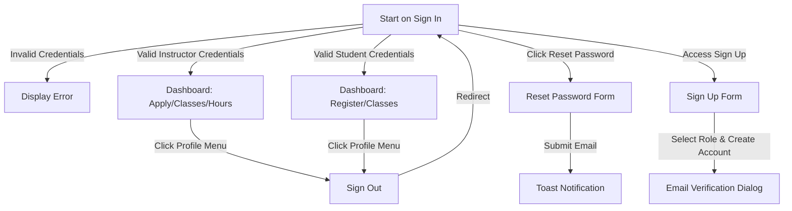

# Portal Release Test Plan

This document details the manual and automated regression test suite to verify all core features of the gbSTEM Portal website before any production release. It is structured sequentially to facilitate direct translation into Cypress E2E tests, focusing on student and instructor access.

## 1. Setup and Pre-requisites

Follow these steps to establish a clean, predictable, local testing environment.

### A. Initialize Local Configuration

1. Copy `.env.example` to `.env.local` in the `portal` directory.
2. Ensure the emulator hosts are configured (uncommented) in `.env.local`:

   ```env
   FIRESTORE_EMULATOR_HOST="127.0.0.1:8080"
   FIREBASE_AUTH_EMULATOR_HOST="127.0.0.1:9099"
   STORAGE_EMULATOR_HOST="127.0.0.1:9199"
   ```

### B. Launch Firebase Emulator Suite (If not already running)

1. Start the Firebase Emulator suite from the `admin` repository (not `portal`):

   ```bash
   npm run emulators
   ```

### C. Seed Local Emulator Database

1. Populate the emulators with mock seed data by running the `admin` repository seed script:

   ```bash
   npm run seed
   ```

### D. Run the Development Server

1. Start the SvelteKit local server for the `portal`:

   ```bash
   npm run dev
   ```

   _Verify that the portal is running at <http://localhost:5173> (or its assigned port) and you can log in._

---

## 2. Test Cases & E2E Validation Sequence

### Section A: Authentication and Navigation



#### Test Case 1: Unauthenticated Redirect to Sign In

- **Description**: Ensure unauthenticated users accessing internal routes are redirected to the sign in page.
- **Steps**:
  1. Clear any active session (e.g., by clicking "Sign Out" in the profile menu if logged in, or clearing browser cookies/localStorage).
  2. Attempt to navigate to `/dashboard`.
  3. Attempt to navigate to `/profile`.
- **Expected Results (Assertions)**:
  - Access is blocked.
  - The URL is rewritten to `/signin`.
  - The browser displays the Sign In form.

#### Test Case 2: Unsuccessful Sign In

- **Description**: Verify that sign in fails when invalid credentials are provided.
- **Steps**:
  1. Navigate to `/signin`.
  2. Type `instructor@gbstem.org` in the **Email** input.
  3. Type `wrongpassword` in the **Password** input.
  4. Click the **"Sign in"** button.
- **Expected Results (Assertions)**:
  - Sign in fails and does not redirect.
  - An alert banner displays the auth error message/styling.

#### Test Case 3a: Successful Sign In as Instructor

- **Description**: Verify that an instructor can successfully sign in and see instructor-specific links.
- **Steps**:
  1. Navigate to `/signin`.
  2. Type `instructor@gbstem.org` in the **Email** input.
  3. Type `penguin` in the **Password** input.
  4. Click the **"Sign in"** button.
- **Expected Results (Assertions)**:
  - Redirects successfully to `/dashboard`.
  - The navigation bar is visible and features links for **Dashboard**, **Apply**, and **Classes**.
  - If the instructor is accepted, the **Community Service Hours Tracker** link is also visible.
  - The **Register** link is NOT visible.

#### Test Case 3b: Successful Sign In as Student/Parent

- **Description**: Verify that a student/parent can successfully sign in and see student-specific links.
- **Steps**:
  1. Navigate to `/signin`.
  2. Type `student@gbstem.org` in the **Email** input.
  3. Type `penguin` in the **Password** input.
  4. Click the **"Sign in"** button.
- **Expected Results (Assertions)**:
  - Redirects successfully to `/dashboard`.
  - The navigation bar features links for **Dashboard**, **Register**, and **Classes**.
  - The **Apply** and **Community Service Hours Tracker** links are NOT visible.

#### Test Case 4: Password Reset Form

- **Description**: Verify the password reset flow can be triggered.
- **Steps**:
  1. Navigate to `/signin`.
  2. Click the **"Forgot password?"** link.
  3. Enter `instructor@gbstem.org` in the **Email** input.
  4. Click the **"Send email"** button.
- **Expected Results (Assertions)**:
  - A notification toast appears showing the password reset email was sent.

#### Test Case 5a: Direct Sign Up as Student/Parent

- **Description**: Verify that a new parent/student account can be created and that the navbar displays correct links after email verification.
- **Steps**:
  1. Navigate to `/signup`.
  2. Select `"Parent registering my child for classes"` in the **I am a...** dropdown.
  3. Fill out the fields:
     - **First name**: `NewStudent`
     - **Last name**: `Parent`
     - **Email**: `newstudentparent@gbstem.org`
     - **Password**: `password123`
     - **Confirm password**: `password123`
  4. Click the **"Sign up"** button.
  5. Verify redirect to `/profile` and that the email verification dialog is displayed.
  6. Verify that the navigation links (**Dashboard**, **Register**, **Classes**) are hidden.
  7. Simulate email verification (e.g. via mock auth update or refreshing the page after verifying email).
- **Expected Results (Assertions)**:
  - Account creation succeeds and redirects to `/profile`.
  - After email verification is complete and the page is refreshed:
    - The email verification banner/dialog disappears.
    - The navigation bar is now visible and features links for **Dashboard**, **Register**, and **Classes**.
    - The **Apply** and **Community Service Hours Tracker** links are NOT visible.

#### Test Case 5b: Direct Sign Up as Instructor

- **Description**: Verify that a new instructor account can be created and that the navbar displays correct links after email verification.
- **Steps**:
  1. Navigate to `/signup`.
  2. Select `"High school/college student applying to be an instructor"` in the **I am a...** dropdown.
  3. Fill out the fields:
     - **First name**: `NewInstructor`
     - **Last name**: `Teacher`
     - **Email**: `newinstructor@gbstem.org`
     - **Password**: `password123`
     - **Confirm password**: `password123`
  4. Click the **"Sign up"** button.
  5. Verify redirect to `/profile` and that the email verification dialog is displayed.
  6. Verify that the navigation links (**Dashboard**, **Apply**, **Classes**) are hidden.
  7. Simulate email verification.
- **Expected Results (Assertions)**:
  - Account creation succeeds and redirects to `/profile`.
  - After email verification is complete and the page is refreshed:
    - The email verification banner/dialog disappears.
    - The navigation bar is now visible and features links for **Dashboard**, **Apply**, and **Classes**.
    - The **Register** link is NOT visible.

---

### Section B: Student Registration & Account Management (Parent/Student Role)

#### Test Case 6: Parent Registration - Manage Multiple Children

- **Description**: Verify that a parent can add up to 5 children accounts.
- **Steps**:
  1. Log in as a student/parent user (`student@gbstem.org` / `penguin`).
  2. Navigate to `/apply` (renders as "Register").
  3. Click **"Add Child Account"** several times.
- **Expected Results (Assertions)**:
  - Each click adds a new child option (e.g., `Child 2`, `Child 3`) to the selector.
  - Adding a 6th child is blocked with an error toast: `"You can only register up to 5 children"`.

#### Test Case 7: Complete and Submit a Registration Form

- **Description**: Verify a parent can fill out and submit the registration form for a child, and the submitted data persists correctly in the database and renders in the post-submission view.
- **Steps**:
  1. Navigate to `/apply` (Register).
  2. Select `Child 1` (or whichever child is currently being registered).
  3. Fill out the **Registration Form**:
     - Student Personal Info: Name, grade, school.
     - Course Preferences: Select first and second choices for CS, Math, Science, and Engineering.
     - Agreements: Check safety agreements and age limit bypass check if appropriate.
  4. Click the **"Submit"** button.
  5. Query the database emulator directly to confirm all submitted values matches the database record.
  6. Reload the page and select the registered child (e.g. `Child 1`) from the selector.
- **Expected Results (Assertions)**:
  - Submission updates the Firestore database under `registrations{Term}/{userId}-1`.
  - A success toast is displayed.
  - UI/UX Design Note: Once registered, the interactive form is hidden and replaced by a success card. The E2E test validates the database records directly.
  - Upon reloading the page and selecting the child, the browser displays the submitted account card layout (`"An account has been created for [Student]!"`).

---

### Section C: Instructor Applications (Instructor Role)

#### Test Case 8: Instructor Application Submission

- **Description**: Verify that an instructor can fill out and submit their teaching application, and the data persists correctly in the database.
- **Steps**:
  1. Log in as an instructor.
  2. Navigate to `/apply` (renders as "Apply").
  3. Fill out the **Application Form**:
     - Contact details, school, graduation year.
     - Courses they want to teach.
     - Timeslots availability.
     - In-person / online preference.
  4. Click the **"Submit"** button.
  5. Query the database emulator directly to confirm all submitted values matches the database record.
  6. Reload the page.
- **Expected Results (Assertions)**:
  - Form state updates in Firestore under `applications{Term}/{userId}`.
  - A success message toast is displayed.
  - UI/UX Design Note: Once applied, the interactive form is replaced with a read-only review screen. The E2E test validates the database records directly.
  - Upon reloading the page, the application review page persists with the message `"Application submitted and in review!"`.

---

### Section D: Class Roster and Details View

#### Test Case 9: Student View Enrolled Classes

- **Description**: Verify that students can view the classes they have been enrolled in.
- **Steps**:
  1. Log in as a student who is enrolled in a class.
  2. Navigate to `/classes`.
- **Expected Results (Assertions)**:
  - The enrolled class details (Course, Instructor, Zoom Link, Class Time) are displayed.

#### Test Case 10: Instructor View Taught Classes

- **Description**: Verify that instructors can see their roster, meeting details, and submit student attendance feedback.
- **Steps**:
  1. Log in as an instructor teaching a class.
  2. Navigate to `/classes`.
- **Expected Results (Assertions)**:
  - The classes the instructor is teaching are displayed.
  - The roster of enrolled students is visible.
  - Meeting links and class times are rendered correctly.

---

### Section E: Community Service Tracking (Instructor Role)

#### Test Case 11: Instructor Community Service Hours Submission

- **Description**: Verify accepted instructors can log, track, and reload their community service hours.
- **Steps**:
  1. Log in as an accepted instructor.
  2. Navigate to `/community-service`.
  3. Add a log entry: select class date, enter hours taught, and notes.
  4. Submit the entry.
  5. Reload the page.
- **Expected Results (Assertions)**:
  - The entry is successfully saved to Firestore and shown in the list.
  - Total community service hours count updates dynamically.
  - Upon reloading the page, the logged entry persists in the list with the correct date, hours, and notes.

---

### Section F: Profile Customization & Account Management

#### Test Case 12: Profile Modifications & Reauthentication

- **Description**: Verify name updates, email changes, password updates, and account deletion persist.
- **Steps**:
  1. Navigate to `/profile`.
  2. Update Full Name, click Save, and then reload the page to verify the name remains updated.
  3. Change Email (requires password reauthentication), reload the page, and verify the email field shows the updated email.
  4. Change Password (requires old password reauthentication).
  5. Delete Account (requires password confirmation).
- **Expected Results (Assertions)**:
  - All operations complete successfully with respective success toasts.
  - Name and email changes are confirmed to be persistent in the database and display correctly after reloading the page.
  - Deleting the account sign out the user and cleans up their auth record.
